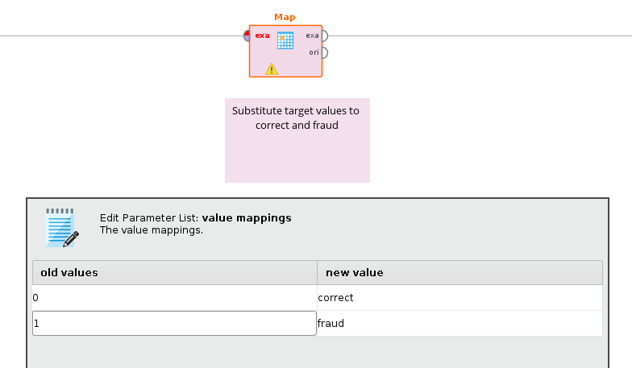

# Data Science Workflow/Applications
by **Ilia Ozhmegov**
2020.06.14 
## Exam 1: Detect Credit Card Fraud
The main task:
Detect credit card fraud based on anonymized transaction data.

### Introduction
1. **A brief introduction to the data**
Was given a csv file `Exam-1.csv`, where as separator is used semicolon. The structure can be seen below:
    ```
'data.frame':	227846 obs. of  31 variables:
 $ Time  : int  0 0 1 1 2 2 7 7 10 10 ...
 $ V1    : num  -1.36 1.192 -1.358 -0.966 -1.158 ...
 $ V2    : num  -0.0728 0.2662 -1.3402 -0.1852 0.8777 ...
 $ V3    : num  2.536 0.166 1.773 1.793 1.549 ...
 $ V4    : num  1.378 0.448 0.38 -0.863 0.403 ...
 $ V5    : num  -0.3383 0.06 -0.5032 -0.0103 -0.4072 ...
 $ V6    : num  0.4624 -0.0824 1.8005 1.2472 0.0959 ...
 $ V7    : num  0.2396 -0.0788 0.7915 0.2376 0.5929 ...
 $ V8    : num  0.0987 0.0851 0.2477 0.3774 -0.2705 ...
 $ V9    : num  0.364 -0.255 -1.515 -1.387 0.818 ...
 $ V10   : num  0.0908 -0.167 0.2076 -0.055 0.7531 ...
 $ V11   : num  -0.552 1.613 0.625 -0.226 -0.823 ...
 $ V12   : num  -0.6178 1.0652 0.0661 0.1782 0.5382 ...
 $ V13   : num  -0.991 0.489 0.717 0.508 1.346 ...
 $ V14   : num  -0.311 -0.144 -0.166 -0.288 -1.12 ...
 $ V15   : num  1.468 0.636 2.346 -0.631 0.175 ...
 $ V16   : num  -0.47 0.464 -2.89 -1.06 -0.451 ...
 $ V17   : num  0.208 -0.115 1.11 -0.684 -0.237 ...
 $ V18   : num  0.0258 -0.1834 -0.1214 1.9658 -0.0382 ...
 $ V19   : num  0.404 -0.146 -2.262 -1.233 0.803 ...
 $ V20   : num  0.2514 -0.0691 0.525 -0.208 0.4085 ...
 $ V21   : num  -0.01831 -0.22578 0.248 -0.1083 -0.00943 ...
 $ V22   : num  0.27784 -0.63867 0.77168 0.00527 0.79828 ...
 $ V23   : num  -0.11 0.101 0.909 -0.19 -0.137 ...
 $ V24   : num  0.0669 -0.3398 -0.6893 -1.1756 0.1413 ...
 $ V25   : num  0.129 0.167 -0.328 0.647 -0.206 ...
 $ V26   : num  -0.189 0.126 -0.139 -0.222 0.502 ...
 $ V27   : num  0.13356 -0.00898 -0.05535 0.06272 0.21942 ...
 $ V28   : num  -0.0211 0.0147 -0.0598 0.0615 0.2152 ...
 $ Amount: num  149.62 2.69 378.66 123.5 69.99 ...
 $ Class : int  0 0 0 0 0 0 0 0 0 0 ...
    ```
As you can see it has 227 846 observations and 31 variables and all of them are numeric. One of them `Class` is a target variable, where 0 means `correct` and 1 means `fraud`, so in the future it will be mapped in more human readable form. Also it is important to mention that variables are pseudo centered and normally distributed, besides that data set is severely unbalanced, it has around 400 entries labeled as `fraud`. 

1. **A brief introduction to the machine learning task**
As was mentioned earlier variable `Class` is the target variable and the main task is correctly distinguish `fraud` (1) and `correct` (0). The important part in here is that we have a priority to classify potential `fraud` entries over `correct` ones, so in other words to classify potential `fraud`s correctly is more important, than classify `correct`s. At the same time if model labels everything as `fraud`, it does not bring much use. So we need carefully think about a parameter optimization, but for now we will be focused at the recall.

1. **A few words about common structure of the report**
This report will follow the points in the given `pdf` paper `Exam-1.pdf` and will be mainly divided in chapters corresponding to the tasks, sometimes it will highlight certain notes. At the end it will have a conclusion part.

### 1. Task: Basic Workflow
1. **Import the data provided in Moodle into RapidMiner**
During the importing provided data set `Exam-1.csv` into RapidMiner there was labeled a variable `Class` and chosen type as binominal.
    <figure class="image" align="center">
      
      <figcaption>Figure 1: data set importing</figcaption>
    </figure>

1. **Do some basic data preparation:**
     * Identify and mark target label:
        As you can see in the `figure 1` it is already done.
     * Substitute target values to *correct* and *fraud*:
To substitute in the target variable values to *correct* and *fraud* was used operator `Map`.
    <figure class="image" align="center">
      
      <figcaption>Figure 2: value substitution</figcaption>
    </figure>
1. **Take 30% of the data as (stratified) holdout for testing**
It is expected that when we find the best machine learning approach, we will test it with 30% of the data.
    <figure class="image" align="center" >
      
      <figcaption>Figure 3: spliting data</figcaption>
    </figure>
1. **Compare the performance of three suitable machine learning algorithms**
Let us start almost interesting part of the report.
    1. The first model is a well-known **Decision Tree** model:
    <figure class="image" align="center" >
      
      <figcaption>Figure 4: Decision Tree (Outer Pipeline)</figcaption>
    </figure>
On this stage it is important to note that in the current section all machine learning Outer Pipelines are the same, so in the future in the current section we will not highlight Outer Pipelines. As you can see in the `figure 4` there were used two processes `Import` (`figure 3`) and `Preprocess` (`figure 2`) that were created according to the requirements in the previous sections of the current part. Also, you should draw attention to the `Store` blocks named *Store Model* and *Store validation* that have self-explanatory names.
    <figure class="image" align="center" >
      
      <figcaption>Figure 5: Decision Tree (Inner pipeline)</figcaption>
    </figure>
